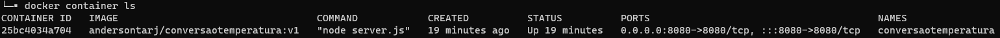
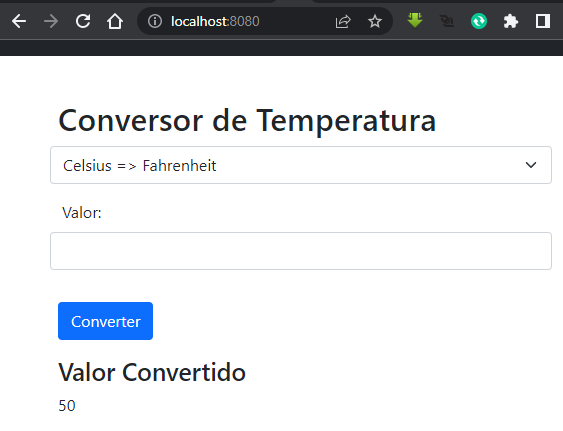

# Desafio Docker KebDev

#### Build e Exec da aplicação Conversor de Temperatura.

> **Nota:** substituir o meu ***workspace*** pelo seu.
>
> **Ex.:** ***andersontarj***/conversaotemperatura pelo ***seu-workspace***/conversaotemperatura

Criando a imagem:

```
docker build -t andersontarj/conversaotemperatura:v1 .
```

Criando a imagem **latest**:

```
docker image tag andersontarj/conversaotemperatura:v1 andersontarj/conversaotemperatura:latest	
```

Executando a imagem criada:

```
docker run --name conversaotemperatura -it -d -p 8888:5000 andersontarj/conversaotemperatura:v1
```

Para verificar o container em execução, execute o comando:

```
docker container ls
```

Terá uma saída igual a abaixo:



Após a execução da imagem **andersontarj/conversaotemperatura** abra o navegador de sua preferencia e digite <http://localhost:8080>

Se tudo estiver correto você vera no navegador a tela igual a que está abaixo:


